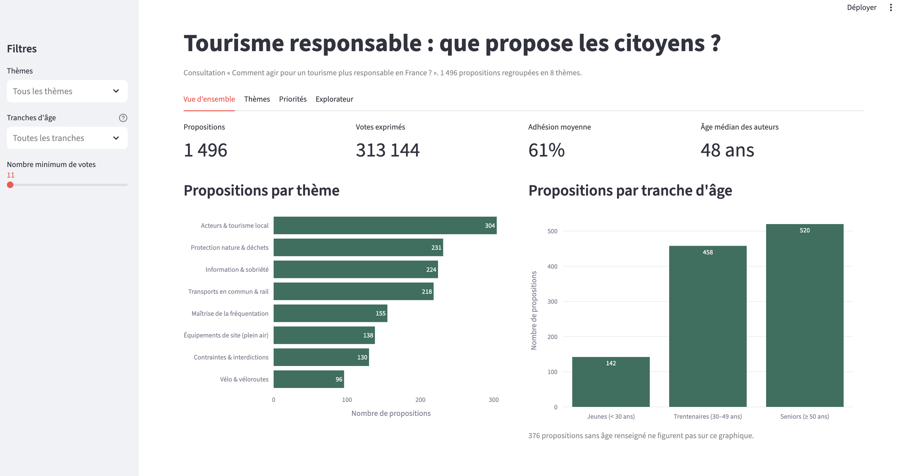
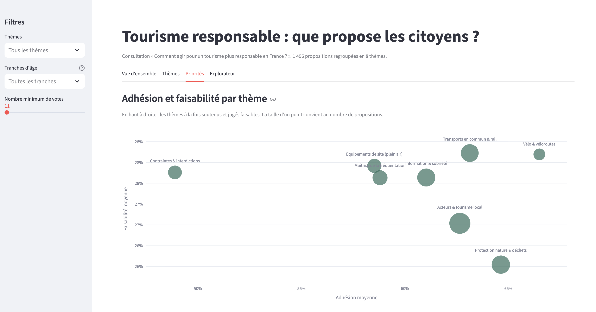

# Tourisme responsable : que proposent les citoyens ?

Analyse de 1 496 propositions citoyennes déposées en réponse à la question « Comment agir pour un tourisme plus responsable en France ? ». Chaque proposition est accompagnée des votes qu'elle a reçus (d'accord, neutre, pas d'accord) et de mentions qualitatives (j'aime, faisable, pas question, etc.).

L'objectif : regrouper les propositions en thèmes, puis repérer les actions qui recueillent le plus d'adhésion et sont jugées faisables.

Le projet comprend un pipeline de traitement reproductible et un tableau de bord Streamlit.

## Aperçu





## Résultats

Les propositions se répartissent en huit thèmes.

| Thème | Propositions | Adhésion | Faisabilité | Controverse |
|---|---:|---:|---:|---:|
| Vélo & véloroutes | 96 | 66,5 % | 28,2 % | 15,7 % |
| Protection nature & déchets | 231 | 64,6 % | 25,5 % | 16,3 % |
| Transports en commun & rail | 218 | 63,1 % | 28,2 % | 19,2 % |
| Acteurs & tourisme local | 304 | 62,7 % | 26,5 % | 13,8 % |
| Information & sobriété | 224 | 61,0 % | 27,6 % | 17,3 % |
| Maîtrise de la fréquentation | 155 | 58,8 % | 27,6 % | 21,6 % |
| Équipements de site (plein air) | 138 | 58,5 % | 27,9 % | 19,8 % |
| Contraintes & interdictions | 130 | 48,9 % | 27,8 % | 32,9 % |

Ce qu'on en retient :

- Les aménagements cyclables arrivent en tête de l'adhésion, devant la protection de la nature et les transports en commun.
- Les mesures contraignantes (taxes, interdictions) sont les seules à passer sous 50 % d'adhésion, et un tiers des votes s'y opposent.
- La faisabilité varie peu d'un thème à l'autre (de 25,5 % à 28,2 %). C'est l'adhésion qui départage les thèmes.

Définition des indicateurs :

- **Adhésion** : part des votes « d'accord » dans le total des votes.
- **Faisabilité** : part des votes « d'accord » accompagnés de la mention « faisable ».
- **Controverse** : part des votes « pas d'accord » dans le total des votes.

## Méthode

1. **Chargement** : lecture du JSON et mise à plat des votes, une ligne par proposition.
2. **Prétraitement** : lemmatisation avec spaCy (`fr_core_news_sm`). On garde les noms, verbes, adjectifs et adverbes, et on retire les mots vides ainsi que le vocabulaire commun à tout le corpus (tourisme, voyage, etc.).
3. **Représentation** : Word2Vec entraîné sur le corpus (100 dimensions, skip-gram). Une proposition est représentée par la moyenne des vecteurs de ses mots.
4. **Regroupement** : KMeans avec K = 8. Chaque thème est nommé d'après ses termes distinctifs, c'est-à-dire les mots plus fréquents dans le thème que dans l'ensemble du corpus.
5. **Indicateurs** : adhésion, faisabilité, controverse, taux de like et de rejet, par proposition puis par thème.

### Limites

- Le score de silhouette est faible (0,16 pour K = 8) : les thèmes se recouvrent en partie, et certaines propositions sont à la frontière de deux thèmes.
- Les propositions sont courtes (16 mots en moyenne), ce qui limite la finesse de la représentation.
- L'âge de l'auteur manque pour un quart des propositions. Les analyses par âge portent sur les 1 120 propositions où il est renseigné.

### Reproductibilité

Les graines aléatoires sont fixées et Word2Vec est entraîné sur un seul thread. Deux exécutions du pipeline donnent les mêmes thèmes.

## Structure du dépôt

```
tourisme-responsable/
├── data/
│   ├── raw/                  # JSON source (non inclus)
│   └── processed/            # sorties du pipeline (non incluses)
├── src/tourisme/
│   ├── config.py             # chemins et paramètres
│   ├── load.py               # chargement et mise à plat des votes
│   ├── preprocess.py         # lemmatisation
│   ├── embed.py              # Word2Vec
│   ├── cluster.py            # KMeans, termes distinctifs, t-SNE
│   └── indicators.py         # indicateurs et tableaux par thème
├── app/streamlit_app.py      # tableau de bord
├── run_pipeline.py           # exécute toutes les étapes
├── pyproject.toml
└── uv.lock
```

## Installation et lancement

Le projet utilise [uv](https://docs.astral.sh/uv/).

```bash
git clone https://github.com/Azetaka/tourisme-responsable.git
cd tourisme-responsable
uv sync
```

Les données ne sont pas incluses dans ce dépôt. Place le fichier source dans `data/raw/data_tourisme.json`, puis :

```bash
uv run python run_pipeline.py              # écrit les résultats dans data/processed/
uv run streamlit run app/streamlit_app.py  # ouvre le tableau de bord
```

## Outils

Python 3.12, uv, pandas, spaCy, gensim, scikit-learn, Plotly, Streamlit.